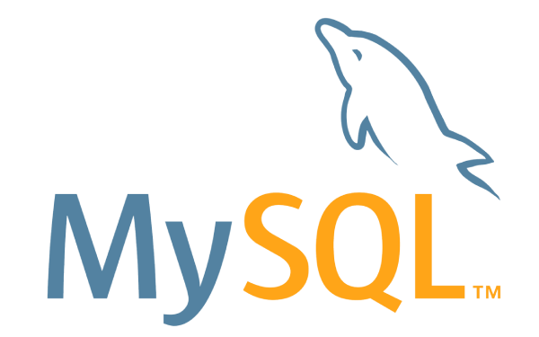

## Documentação Introdutória ao MySQL

Este repositório contém uma documentação abrangente e introdutória sobre bancos de dados MySQL, abordando desde os conceitos básicos até tópicos avançados. Abaixo está o sumário dos conteúdos disponíveis:

### Sumário
1. **[Introdução](docs/introducao.md)**
   - O que é o MySQL
   - História e propósito do MySQL
   - Instalação e configuração básica
2. **[Comandos SQL Básicos](docs/comandos_sql_basicos.md)**
   - Visão geral da linguagem SQL
   - Consultas SELECT
   - Inserção, atualização e exclusão de dados
   - Ordenação de resultados
   - Filtros e condições WHERE
   - Uso de funções básicas
3. **[Consultas Avançadas](docs/consultas_avancadas.md)**
   - Uso de joins para combinar tabelas
   - Subconsultas
   - Agrupamento de dados com GROUP BY
   - Filtros avançados com HAVING
   - Uso de funções de agregação
4. **[Modelagem de Dados](docs/modelagem_de_dados.md)**
   - Entidades e relacionamentos
   - Chaves primárias e estrangeiras
   - Normalização de banco de dados
   - Modelagem de esquema ER
5. **[Gerenciamento de Tabelas](docs/gerenciamento_de_tabelas.md)**
   - Criação e alteração de tabelas
   - Restrições de integridade
   - Índices e otimização de desempenho
   - Chaves únicas e valores padrão
6. **[Transações e Controle de Concorrência](docs/transacoes_e_controle_de_concorrencia.md)**
   - Conceitos de transação
   - Propriedades ACID
   - Controle de concorrência
   - Uso de locks e transações isoladas
7. **[Stored Procedures e Funções](docs/stored_procedures_e_funcoes.md)**
   - Criação e chamada de stored procedures
   - Parâmetros de entrada e saída
   - Funções definidas pelo usuário
   - Uso de cursores
8. **[Segurança e Gerenciamento de Usuários](docs/seguranca_e_gerenciamento_de_usuarios.md)**
    - Gerenciamento de contas de usuário
    - Permissões e privilégios
    - Políticas de segurança
    - Backup e recuperação de dados
9. **[Otimização e Ajuste de Desempenho](docs/otimizacao_e_ajuste_de_desempenho.md)**
    - Ferramentas de monitoramento e diagnóstico
    - Perfil de consultas
    - Índices e otimização de consultas
    - Configurações de cache e memória
10. **[Replicação e Escalabilidade](docs/replicacao_e_escalabilidade.md)**
    - Configuração de replicação
    - Replicação master-slave e master-master
    - Particionamento de tabelas
    - Sharding e distribuição de dados

---

Este é um ótimo guia para iniciantes e desenvolvedores que desejam aprofundar seus conhecimentos em SQL usando o MySQL, oferecendo uma base sólida para a administração e otimização de bancos de dados.

---

**OBS:** É indicado que você use o tema do seu GitHub em branco para uma melhor visualização da documentação.