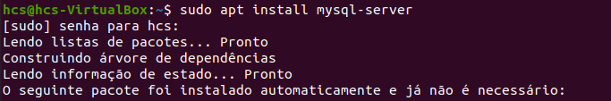

### O que é o MySQL

O MySQL é um sistema de gerenciamento de banco de dados relacional (SGBDR) amplamente utilizado, que oferece uma solução poderosa e flexível para armazenar, gerenciar e recuperar dados. Ele foi desenvolvido pela empresa sueca MySQL AB e, atualmente, é mantido e aprimorado pela Oracle Corporation.

<div align="center">
    
    <br>
    <figcaption>Sede da Oracle Corporation em Redwood Shores, California
        <sup>
            <a href="https://twitter.com/oracledobrasil/status/387033276877385728" target="_blank"> 
                [1]
            </a>
        </sup>
    </figcaption>
    <br><br>
</div>

O MySQL foi projetado para ser um banco de dados confiável, rápido e eficiente, capaz de lidar com uma grande quantidade de dados e um alto volume de transações. Ele oferece suporte à linguagem de consulta estruturada (SQL), que é a linguagem padrão para interagir com bancos de dados relacionais. Com o MySQL, é possível executar uma ampla variedade de operações de manipulação e consulta de dados.
Uma das principais vantagens do MySQL é a sua escalabilidade, permitindo que ele seja usado desde pequenos projetos até aplicações empresariais de grande porte. Além disso, o MySQL é conhecido por sua estabilidade, confiabilidade e segurança, sendo amplamente adotado por organizações de diversos setores.

<div align="center">
    
    <br>
    <figcaption>Algumas empresas que usam MySQL
        <sup>
            <a href="https://www.mysql.com/" target="_blank">
                [2]
            </a>
        </sup>
    </figcaption>
    <br><br>
</div>

O MySQL possui uma ampla comunidade de usuários e desenvolvedores, o que contribui para a sua popularidade e para a disponibilidade de recursos e suporte. Existem várias ferramentas e interfaces gráficas disponíveis para facilitar a administração e o desenvolvimento de aplicações com o MySQL.

No capítulo de introdução, exploraremos em mais detalhes a história e o propósito do MySQL, além de fornecer instruções sobre como instalar e configurar o MySQL em seu ambiente de desenvolvimento.


---
### História e Propósito do MySQL

O MySQL tem uma história rica e uma evolução significativa desde o seu surgimento. Foi criado originalmente por um grupo de desenvolvedores suecos, liderados por Michael "Monty" Widenius, David Axmark e Allan Larsson, na década de 1990. Eles buscavam um sistema de gerenciamento de banco de dados que fosse confiável, rápido e fácil de usar.

<div align="center">
    
    <br>
    <figcaption>Fundadores do MySQL, David Axmark, Allan Larsson e Michael "Monty" Widenius
        <sup>
            <a href="https://www.di.se/digital/uppgifter-alibaba-gar-in-i-svenskarnas-databastjanst/" target="_blank">
                [3]
            </a>
        </sup>
    </figcaption>
    <br><br>
</div>

Em 1995, o MySQL foi lançado como um projeto de código aberto com o objetivo de fornecer um banco de dados relacional gratuito para a comunidade de desenvolvedores. Sua arquitetura modular e a capacidade de se integrar facilmente a outras tecnologias fizeram com que ele se destacasse rapidamente.

Com o passar do tempo, o MySQL ganhou popularidade em todo o mundo, sendo amplamente adotado tanto por pequenas empresas quanto por grandes corporações. Sua escalabilidade e desempenho eficiente tornaram-no uma escolha popular para uma ampla gama de aplicativos, desde sites simples até aplicações complexas e de alto tráfego.

Em 2008, a empresa Sun Microsystems adquiriu a MySQL AB, levando o MySQL a fazer parte do portfólio da Sun. Essa aquisição trouxe ainda mais recursos e investimentos para o desenvolvimento contínuo do MySQL.
Posteriormente, em 2010, a Oracle Corporation adquiriu a Sun Microsystems, incluindo o MySQL em sua lista de produtos. A Oracle continuou a investir no aprimoramento do MySQL, mantendo o compromisso com a comunidade de código aberto e fornecendo suporte e serviços comerciais.

<div align="center">
    
    <br>
    <figcaption>Vinod Khosla, Andy Bechtolsheim , Bill Joy e Scott McNealy: fundadores da Sun
        <sup>
            <a href="https://museucapixaba.com.br/hoje/fundacao-da-sun-microsystems-em-1982/" target="_blank">
                [4]
            </a>
        </sup>
    </figcaption>
    <br><br>
</div>

O MySQL foi projetado para atender a uma variedade de necessidades, desde aplicativos web até sistemas de missão crítica. Seu propósito principal é fornecer um banco de dados relacional flexível e altamente confiável, capaz de gerenciar grandes volumes de dados e transações simultâneas.
Com sua arquitetura robusta, o MySQL é capaz de lidar com uma carga de trabalho exigente e oferece recursos como replicação, particionamento e clustering para melhorar a escalabilidade e a disponibilidade dos dados.

O MySQL também se destaca pela sua facilidade de uso. Sua linguagem SQL intuitiva e a ampla gama de ferramentas e interfaces gráficas disponíveis tornam o desenvolvimento e a administração de bancos de dados MySQL acessíveis mesmo para aqueles que têm pouca experiência com sistemas de gerenciamento de banco de dados.

Em resumo, a história do MySQL é marcada por sua origem como um projeto de código aberto e seu crescimento como um dos sistemas de gerenciamento de banco de dados mais populares do mundo. Seu propósito é fornecer uma solução confiável, escalável e de alto desempenho para armazenamento e recuperação de dados, atendendo às necessidades tanto de pequenos projetos quanto de grandes aplicações empresariais.

---
### Instalação e Configuração Básica

Agora você aprenderá a instalar e configurar o MySQL em seu ambiente, tanto para o sistema operacional Windows quanto para o Linux (Ubuntu). Além disso, também abordaremos a instalação do MySQL Workbench, uma ferramenta gráfica popular para administrar e interagir com bancos de dados MySQL. Vamos começar!

## Instalação do MySQL no Windows

**Passo 1:** Acesse o site oficial do MySQL (https://www.mysql.com) e navegue até a seção de downloads.

<div align="center">
    
    <br><br>
</div>

**Passo 2:** Na página de downloads, clique no botão "MySQL Community (GPL) Downloads".

<div align="center">
    
    <br><br>
</div>

**Passo 3:** Role a página para baixo até encontrar a seção "MySQL Installer for Windows". Clique no botão "Download" para baixar .

<div align="center">
    
    <br><br>
</div>

O site oficial do MySQL oferece várias opções de download, incluindo o MySQL Installer for Windows, que é uma ferramenta que facilita a instalação e a configuração do MySQL Server e outras ferramentas relacionadas.

Olhando novamente a imagem acima, você pode perceber que existem algumas ferramentas e softwares extras que auxiliam o trabalho de desenvolvimento com o MySQL. 

Ao clicar em "MySQL Installer for Windows" estamos escolhendo um software que irá instalar o MySQL Server, o MySQL Workbench e outras ferramentas que podem ser úteis para o desenvolvimento de aplicações com MySQL. Tudo de forma centralizada e simplificada.

**Passo 4:** Observe que o site irá fornecer duas opções de download, uma com a versão 5 e outra com a versão 8. A diferença entre elas é que a versão 5 é mais antiga e a versão 8 é mais recente, porém ambas são estáveis e funcionais. A versão 5 ainda existe devido a alta quantidade de aplicações que ainda utilizam essa versão, por isso ainda é possível baixá-la e explorar suas funcionalidades.

Mantenha a versão 8 selecionada. No dia atual no qual este guia foi escrito, a versão 8 mais recente é a 8.0.37, mas pode ser que você se depare com algumas versões mais recentes. Não se preocupe, dificilmente haverá mudanças significativas entre as versões e o modo de instalação será o mesmo.

<div align="center">
    
    <br><br>
</div>

**Passo 5:** Observe que existe duas versões do MySQL Installer for Windows: a versão web e a versão offline. A versão web é um instalador pequeno que baixa os arquivos necessários durante a instalação, enquanto a versão offline é um instalador maior que inclui todos os arquivos necessários.

Tenha preferência pela versão offline, pois ela é mais rápida e não depende de uma conexão com a internet para baixar os arquivos necessários.

Clique no botão "Download" para baixar a versão offline do MySQL Installer for Windows.

**Passo 6:** Você será encaminhado para a página de download do MySQL Installer for Windows. A Oracle utiliza esta página para capturar leads para seus produtos. Clique no botão "No thanks, just start my download." para iniciar o download do instalador.

<div align="center">
    
    <br><br>
</div>


## Instalação do MySQL no Linux (Ubuntu)

Abra o terminal e execute os seguintes comandos para instalar o MySQL Server no Ubuntu:

```bash
sudo apt update && sudo apt upgrade
```
<div align="center">
    
    <br><br>
</div>


Este comando irá atualizar a lista de pacotes disponíveis e instalar as atualizações disponíveis para o sistema.


```bash
sudo apt install mysql-server
```
<div align="center">
    
    <br><br>
</div>


Este comando irá instalar o MySQL Server no Ubuntu.


```bash
sudo systemctl start mysql.service
```
<div align="center">
    
    <br><br>
</div>

```bash
sudo mysql_secure_installation
```
<div align="center">
    
    <br><br>
</div>

O MySQL permite que façamos algumas configurações de segurança após a instalação. O comando `mysql_secure_installation` irá guiá-lo através de um processo para configurar a senha do usuário root, remover usuários anônimos, desativar o login remoto do root e remover o banco de dados de teste.

Recomendações de segurança:
- Defina uma senha forte para o usuário root.
- Remova os usuários anônimos.
- Desative o login remoto do root.
- Remova o banco de dados de teste.
- Recarregue os privilégios para que as alterações tenham efeito.

Após a instalação e configuração do MySQL Server, você pode instalar o MySQL Workbench, uma ferramenta gráfica para administrar e interagir com bancos de dados MySQL.

```bash
mysql -u root -p
```
<div align="center">
    
    <br><br>
</div>

Este comando irá conectar ao servidor MySQL usando o usuário root. Você será solicitado a inserir a senha do usuário root que você configurou anteriormente.

Caso você tenha desejo de utilizar uma interface gráfica para interagir com o MySQL, você pode instalar o MySQL Workbench. Você pode realizar a instalação dele pela Ubuntu Software ou pelo terminal.

Pronto seu MySQL está instalado e você já pode começar a utilizá-lo.

### Referências Externas

[1] - Oracle Brasil (2013). Via X (@oracledobrasil). Acessado em 25 de junho de 2024, às 13:40.

[2] - Site oficial do MySQL (2024). Acessado em 26 de junho de 2024, às 10:17.

[3] - Fotos: Di/Malehmann, Flickr/James Duncan Davidson/O'Reilly Media.

[4] - Via site Museu Capixaba do Computador. Acessado em 26 de junho de 2024, às 10:29.

---
<div align="center">
    <a href=""><kbd> <br> Capítulo Anterior <br> </kbd></a>‎ ‎ ‎ ‎ ‎ ‎ ‎ ‎ ‎ ‎ ‎ ‎ ‎ ‎ ‎ ‎ ‎ ‎ ‎ ‎ ‎ ‎ ‎ ‎ ‎ ‎ ‎ ‎ ‎ ‎ ‎ ‎ ‎ ‎ ‎ ‎ ‎ ‎ ‎ ‎ ‎ ‎ ‎ ‎ ‎ ‎ ‎ ‎ ‎ ‎ ‎ ‎ ‎ ‎ ‎ ‎ ‎ ‎ ‎ ‎ ‎ ‎ ‎ ‎ ‎ ‎ ‎ 
    <a href="comandos_sql_basicos.md"><kbd> <br> Próximo Capítulo <br> </kbd></a>
</div>