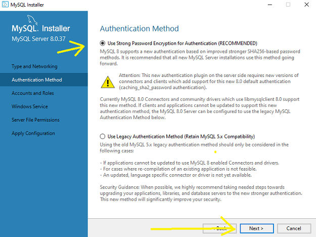

### O que é o MySQL

O MySQL é um sistema de gerenciamento de banco de dados relacional (SGBDR) amplamente utilizado, que oferece uma solução poderosa e flexível para armazenar, gerenciar e recuperar dados. Ele foi desenvolvido pela empresa sueca MySQL AB e, atualmente, é mantido e aprimorado pela Oracle Corporation.

<div align="center">
    
    <br>
    <figcaption>Sede da Oracle Corporation em Redwood Shores, California
        <sup>
            <a href="https://twitter.com/oracledobrasil/status/387033276877385728" target="_blank"> 
                [1]
            </a>
        </sup>
    </figcaption>
    <br><br>
</div>

O MySQL foi projetado para ser um banco de dados confiável, rápido e eficiente, capaz de lidar com uma grande quantidade de dados e um alto volume de transações. Ele oferece suporte à linguagem de consulta estruturada (SQL), que é a linguagem padrão para interagir com bancos de dados relacionais. Com o MySQL, é possível executar uma ampla variedade de operações de manipulação e consulta de dados.
Uma das principais vantagens do MySQL é a sua escalabilidade, permitindo que ele seja usado desde pequenos projetos até aplicações empresariais de grande porte. Além disso, o MySQL é conhecido por sua estabilidade, confiabilidade e segurança, sendo amplamente adotado por organizações de diversos setores.

<div align="center">
    
    <br>
    <figcaption>Algumas empresas que usam MySQL
        <sup>
            <a href="https://www.mysql.com/" target="_blank">
                [2]
            </a>
        </sup>
    </figcaption>
    <br><br>
</div>

O MySQL possui uma ampla comunidade de usuários e desenvolvedores, o que contribui para a sua popularidade e para a disponibilidade de recursos e suporte. Existem várias ferramentas e interfaces gráficas disponíveis para facilitar a administração e o desenvolvimento de aplicações com o MySQL.

No capítulo de introdução, exploraremos em mais detalhes a história e o propósito do MySQL, além de fornecer instruções sobre como instalar e configurar o MySQL em seu ambiente de desenvolvimento.


---
### História e Propósito do MySQL

O MySQL tem uma história rica e uma evolução significativa desde o seu surgimento. Foi criado originalmente por um grupo de desenvolvedores suecos, liderados por Michael "Monty" Widenius, David Axmark e Allan Larsson, na década de 1990. Eles buscavam um sistema de gerenciamento de banco de dados que fosse confiável, rápido e fácil de usar.

<div align="center">
    
    <br>
    <figcaption>Fundadores do MySQL, David Axmark, Allan Larsson e Michael "Monty" Widenius
        <sup>
            <a href="https://www.di.se/digital/uppgifter-alibaba-gar-in-i-svenskarnas-databastjanst/" target="_blank">
                [3]
            </a>
        </sup>
    </figcaption>
    <br><br>
</div>

Em 1995, o MySQL foi lançado como um projeto de código aberto com o objetivo de fornecer um banco de dados relacional gratuito para a comunidade de desenvolvedores. Sua arquitetura modular e a capacidade de se integrar facilmente a outras tecnologias fizeram com que ele se destacasse rapidamente.

Com o passar do tempo, o MySQL ganhou popularidade em todo o mundo, sendo amplamente adotado tanto por pequenas empresas quanto por grandes corporações. Sua escalabilidade e desempenho eficiente tornaram-no uma escolha popular para uma ampla gama de aplicativos, desde sites simples até aplicações complexas e de alto tráfego.

Em 2008, a empresa Sun Microsystems adquiriu a MySQL AB, levando o MySQL a fazer parte do portfólio da Sun. Essa aquisição trouxe ainda mais recursos e investimentos para o desenvolvimento contínuo do MySQL.
Posteriormente, em 2010, a Oracle Corporation adquiriu a Sun Microsystems, incluindo o MySQL em sua lista de produtos. A Oracle continuou a investir no aprimoramento do MySQL, mantendo o compromisso com a comunidade de código aberto e fornecendo suporte e serviços comerciais.

<div align="center">
    
    <br>
    <figcaption>Vinod Khosla, Andy Bechtolsheim , Bill Joy e Scott McNealy: fundadores da Sun
        <sup>
            <a href="https://museucapixaba.com.br/hoje/fundacao-da-sun-microsystems-em-1982/" target="_blank">
                [4]
            </a>
        </sup>
    </figcaption>
    <br><br>
</div>

O MySQL foi projetado para atender a uma variedade de necessidades, desde aplicativos web até sistemas de missão crítica. Seu propósito principal é fornecer um banco de dados relacional flexível e altamente confiável, capaz de gerenciar grandes volumes de dados e transações simultâneas.
Com sua arquitetura robusta, o MySQL é capaz de lidar com uma carga de trabalho exigente e oferece recursos como replicação, particionamento e clustering para melhorar a escalabilidade e a disponibilidade dos dados.

O MySQL também se destaca pela sua facilidade de uso. Sua linguagem SQL intuitiva e a ampla gama de ferramentas e interfaces gráficas disponíveis tornam o desenvolvimento e a administração de bancos de dados MySQL acessíveis mesmo para aqueles que têm pouca experiência com sistemas de gerenciamento de banco de dados.

Em resumo, a história do MySQL é marcada por sua origem como um projeto de código aberto e seu crescimento como um dos sistemas de gerenciamento de banco de dados mais populares do mundo. Seu propósito é fornecer uma solução confiável, escalável e de alto desempenho para armazenamento e recuperação de dados, atendendo às necessidades tanto de pequenos projetos quanto de grandes aplicações empresariais.

---
### Instalação e Configuração Básica

Agora você aprenderá a instalar e configurar o MySQL em seu ambiente, tanto para o sistema operacional Windows quanto para o Linux (Ubuntu). Além disso, também abordaremos a instalação do MySQL Workbench, uma ferramenta gráfica popular para administrar e interagir com bancos de dados MySQL. Vamos começar!

## Instalação do MySQL no Windows

**Passo 1:** Acesse o site oficial do MySQL (https://www.mysql.com) e navegue até a seção de downloads.

<div align="center">
    
    <br><br>
</div>

**Passo 2:** Na página de downloads, clique no botão "MySQL Community (GPL) Downloads".

<div align="center">
    
    <br><br>
</div>

**Passo 3:** Role a página para baixo até encontrar a seção "MySQL Installer for Windows". Clique no botão "Download" para baixar .

<div align="center">
    
    <br><br>
</div>

O site oficial do MySQL oferece várias opções de download, incluindo o MySQL Installer for Windows, que é uma ferramenta que facilita a instalação e a configuração do MySQL Server e outras ferramentas relacionadas.

Olhando novamente a imagem acima, você pode perceber que existem algumas ferramentas e softwares extras que auxiliam o trabalho de desenvolvimento com o MySQL. 

Ao clicar em "MySQL Installer for Windows" estamos escolhendo um software que irá instalar o MySQL Server, o MySQL Workbench e outras ferramentas que podem ser úteis para o desenvolvimento de aplicações com MySQL. Tudo de forma centralizada e simplificada.

**Passo 4:** Observe que o site irá fornecer duas opções de download, uma com a versão 5 e outra com a versão 8. A diferença entre elas é que a versão 5 é mais antiga e a versão 8 é mais recente, porém ambas são estáveis e funcionais. A versão 5 ainda existe devido a alta quantidade de aplicações que ainda utilizam essa versão, por isso ainda é possível baixá-la e explorar suas funcionalidades.

Mantenha a versão 8 selecionada. No dia atual no qual este guia foi escrito, a versão 8 mais recente é a 8.0.37, mas pode ser que você se depare com algumas versões mais recentes. Não se preocupe, dificilmente haverá mudanças significativas entre as versões e o modo de instalação será o mesmo.

<div align="center">
    
    <br><br>
</div>

**Passo 5:** Observe que existe duas versões do MySQL Installer for Windows: a versão web e a versão offline. A versão web é um instalador pequeno que baixa os arquivos necessários durante a instalação, enquanto a versão offline é um instalador maior que inclui todos os arquivos necessários.

Tenha preferência pela versão offline, pois ela é mais rápida e não depende de uma conexão com a internet para baixar os arquivos necessários.

Clique no botão "Download" para baixar a versão offline do MySQL Installer for Windows.

**Passo 6:** Você será encaminhado para a página de download do MySQL Installer for Windows. A Oracle utiliza esta página para capturar leads para seus produtos. Clique no botão "No thanks, just start my download." para iniciar o download do instalador.

<div align="center">
    
    <br><br>
</div>

**Passo 7:** Após o download do instalador, execute o arquivo baixado para iniciar o processo de instalação dos produtos do MySQL.

<div align="center">
    
    <br><br>
</div>

**Passo 8:** Ao executar a aplicação, o instalador identificará que não temos o MySQL instalado em nossa máquina. Então ele nos leva para uma tela de escolha de produtos.

<div align="center">
    
    <br><br>
</div>

| Nome        | Descrição                                                                                               |
|-------------|---------------------------------------------------------------------------------------------------------|
| Server Only | Instala apenas a aplicação necessária para iniciar um servidor de banco de dados na sua máquina         |
| Client Only | Instala apenas as aplicações necessárias para acessar e manipular um servidor de banco de dados externo |
| Full        | Instala todas as aplicações disponíveis para o MySQL                                                    |
| Customize   | Você escolhe quais aplicações serão instaladas de acordo com o seu perfil de uso                        |

Vamos escolher a opção "Full" para instalar todas as aplicações disponíveis para o MySQL.

É possível que após a execução deste passo, o instalador abra uma tela de conflitos de porta ou de diretórios já existentes. Caso isso aconteça, clique em "Next" para prosseguir com a instalação. O instalador irá configurar automaticamente as portas e diretórios necessários para o funcionamento do MySQL.

**Passo 9:** Após escolher a opção "Full", clique em "Next" para prosseguir para as instalações. Aperte em "Execute" para o instalador baixar os arquivos necessários para a execução do serviço. Este processo pode demorar um pouco, dependendo da velocidade da sua conexão com a internet.

<div align="center">
    
    <br><br>
</div>

Não se preocupe caso as versões dos produtos sejam diferentes das que estão na imagem. A Oracle atualiza constantemente os produtos e as versões podem mudar.

| Produto              | Descrição                                                                                                                                                                                                                                                 |
|----------------------|-----------------------------------------------------------------------------------------------------------------------------------------------------------------------------------------------------------------------------------------------------------|
| MySQL Server         | É o núcleo do sistema de gerenciamento de banco de dados. Ele permite a criação, gerenciamento e manipulação de bancos de dados. Oferece recursos como armazenamento seguro, alta disponibilidade, replicação, partição de tabelas e suporte a transações |
| MySQL Workbench      | É uma ferramenta visual integrada para desenvolvedores de banco de dados. Ele fornece uma interface gráfica para projetar, modelar, gerar e gerenciar bancos de dados MySQL                                                                               |
| MySQL Shell          | É uma ferramenta interativa avançada para administrar e desenvolver bancos de dados MySQL. Ele suporta três modos principais: SQL, JavaScript e Python                                                                                                    |
| MySQL Router         | É uma ferramenta de middleware que facilita a distribuição de conexões de aplicação para múltiplos servidores MySQL                                                                                                                                       |
| MySQL Documentation  | A documentação oferece uma extensa coleção de guias, manuais de referência, tutoriais e exemplos para ajudar os usuários a entender e utilizar todos os aspectos do MySQL                                                                                 |
| Samples and Examples | São conjuntos de dados e exemplos de código fornecidos para ajudar os usuários a aprender a usar o MySQL de maneira eficaz                                                                                                                                |

**Passo 10:** Clique no botão execute e espere todos os produtos serem instalados. Após a instalação, clique em "Next" para prosseguir, assim como está na imagem.

<div align="center">
    
    <br><br>
</div>

**Passo 11:** Na próxima tela, o instalador deixa claro que seguirá com a instalação automática do servidor, do router e dos exemplos. Clique em "Next" para prosseguir.

<div align="center">
    
    <br><br>
</div>

**Passo 12:** Nesta etapa o instalador está configurando os requisitos de rede. Por padrão deixamos o "Config Type" como "Development Computer", mas há opções dedicadas a criação de servidores para máquinas dedicas, o que não é o nosso caso já que pretendemos usar o MySQL para desenvolvimento e manter a nossa máquina como um ambiente de desenvolvimento. Clique em "Next" para prosseguir.

<div align="center">
    
    <br><br>
</div>

**Passo 13:** Nesta etapa iremos configurar o método de autenticação do MySQL. Por padrão, o MySQL utiliza o método de autenticação baseado em senha, que é o mais seguro. Clique em "Next" para prosseguir.

<div align="center">
    
    <br><br>
</div>

**Passo 14:** Nesta etapa estaremos configurando a senha do usuário root do MySQL. A senha do usuário root é a senha do administrador do MySQL, que tem acesso total ao servidor de banco de dados. É importante definir uma senha forte e segura para o usuário root. 

**NÃO ESQUEÇA A SENHA DO USUÁRIO ROOT!**

Caso você esqueça a senha do usuário root, será necessário reinstalar o MySQL para recuperar o acesso ao servidor de banco de dados.

Abaixo há uma tabelinha para a criação de usuários para o MySQL, iremos mexer nisso mais para frente, mas é importante que você saiba que o MySQL permite a criação de usuários com diferentes níveis de acesso ao servidor de banco de dados.

Após configurado a senha do usuário Root, clique em "Next" para prosseguir.

<div align="center">
    
    <br><br>
</div>

Para termos uma ideia de como funciona a hierarquia de usuários em servidores:

<div align="center">
    
    <br><br>
</div>

O usuário "root" é o superusuário do MySQL, que tem acesso total ao servidor de banco de dados e pode executar qualquer operação. Ele é o administrador do MySQL e é responsável por configurar e gerenciar o servidor de banco de dados.

Por padrão, em empresas e projetos de grande porte o acesso é dividido para garantir a segurança e a integridade dos dados. Os usuários são criados com diferentes níveis de acesso, dependendo das suas funções e responsabilidades.

Os "devs" são os desenvolvedores que têm permissão para acessar e manipular os dados do banco de dados, mas não têm permissão para realizar operações de administração no servidor. Eles são responsáveis por criar, consultar, atualizar e excluir dados, bem como por otimizar consultas e garantir a integridade dos dados.

As "aplicações" são os usuários que são usados pelas aplicações para se conectar ao servidor de banco de dados. Eles têm permissões limitadas para acessar e manipular os dados de acordo com as necessidades da aplicação. Eles são responsáveis por executar consultas, inserir dados, atualizar registros e, em alguns casos, excluir informações.

Os "dbas" (Database Administrator) são os usuários que têm permissão para realizar operações de administração no servidor de banco de dados. Eles são responsáveis por configurar e gerenciar o servidor, criar e gerenciar usuários, definir permissões e privilégios, monitorar o desempenho e a integridade dos dados, realizar backups e recuperações, entre outras tarefas.

**Passo 15:** A próxima etapa é configurar o MySQL como um serviço do Windows. Deixe a opção "Configure MySQL Server as a Windows Service" marcada.

Isso fará com que o MySQL seja executado como um serviço do Windows, o que significa que ele será iniciado automaticamente quando o computador for ligado e será executado em segundo plano, mesmo que nenhum usuário esteja logado no sistema.

Abaixo há a opção de criar o serviço apenas ao entrar no Windows com um usuário determinado. Deixe a opção "Standard System Account" marcada para que o MySQL seja iniciado automaticamente quando o sistema for ligado.

Clique em "Next" para prosseguir.

<div align="center">
    
    <br><br>
</div>

**Passo 16:** O MySQL armazena todos os seus dados dentro de um diretório específico do computador. Esta etapa pergunta qual será o nível de segurança do diretório onde os dados do MySQL serão armazenados. Por padrão, deixamos a primeira opção marcada, para evitar complicações com futuros backups.

<div align="center">
    
    <br><br>
</div>

**Passo 17:** Partindo para o final da instalação, aplique as configurações que você fez até agora. Clique em "Execute" para que o instalador aplique as configurações e instale o MySQL Server.

<div align="center">
    
    <br><br>
</div>

**Passo 18:** Tente realizar a conexão com o servidor para validar se o MySQL foi instalado corretamente. Clique em "Check" para que o instalador valide a conexão com o servidor.

<div align="center">
    
    <br><br>
</div>

**Passo 19:** Após a validação da conexão, clique em "Finish" para finalizar a instalação do MySQL Server.

<div align="center">
    
    <br><br>
</div>

**Passo 20:** Mantenha "Start MySQL Workbench after setup" marcado e aperte em "Finish", isso fará com que você tenha acesso à ferramente visual de manipulação do banco de dados.

A segunda opção irá iniciar o MySQL Shell, uma ferramenta de linha de comando para interagir com o servidor de banco de dados.

<div align="center">
    
    <br><br>
</div>

Pronto seu MySQL está instalado e você já pode começar a utilizá-lo.

---

## Instalação do MySQL no Linux (Ubuntu)

Abra o terminal e execute os seguintes comandos para instalar o MySQL Server no Ubuntu:

```bash
sudo apt update && sudo apt upgrade
```
<div align="center">
    
    <br><br>
</div>


Este comando irá atualizar a lista de pacotes disponíveis e instalar as atualizações disponíveis para o sistema.


```bash
sudo apt install mysql-server
```
<div align="center">
    
    <br><br>
</div>


Este comando irá instalar o MySQL Server no Ubuntu.


```bash
sudo systemctl start mysql.service
```
<div align="center">
    
    <br><br>
</div>

```bash
sudo mysql_secure_installation
```
<div align="center">
    
    <br><br>
</div>

O MySQL permite que façamos algumas configurações de segurança após a instalação. O comando `mysql_secure_installation` irá guiá-lo através de um processo para configurar a senha do usuário root, remover usuários anônimos, desativar o login remoto do root e remover o banco de dados de teste.

Recomendações de segurança:
- Defina uma senha forte para o usuário root.
- Remova os usuários anônimos.
- Desative o login remoto do root.
- Remova o banco de dados de teste.
- Recarregue os privilégios para que as alterações tenham efeito.

Após a instalação e configuração do MySQL Server, você pode instalar o MySQL Workbench, uma ferramenta gráfica para administrar e interagir com bancos de dados MySQL.

```bash
mysql -u root -p
```
<div align="center">
    
    <br><br>
</div>

Este comando irá conectar ao servidor MySQL usando o usuário root. Você será solicitado a inserir a senha do usuário root que você configurou anteriormente.

Caso você tenha desejo de utilizar uma interface gráfica para interagir com o MySQL, você pode instalar o MySQL Workbench. Você pode realizar a instalação dele pela Ubuntu Software ou pelo terminal.

<div align="center">
    
    <br><br>
</div>

Pronto seu MySQL está instalado e você já pode começar a utilizá-lo.

### Referências Externas

[1] - Oracle Brasil (2013). Via X (@oracledobrasil). Acessado em 25 de junho de 2024, às 13:40.

[2] - Site oficial do MySQL (2024). Acessado em 26 de junho de 2024, às 10:17.

[3] - Fotos: Di/Malehmann, Flickr/James Duncan Davidson/O'Reilly Media.

[4] - Via site Museu Capixaba do Computador. Acessado em 26 de junho de 2024, às 10:29.

---
<div align="center">
    <a href=""><kbd> <br> Capítulo Anterior <br> </kbd></a>‎ ‎ ‎ ‎ ‎ ‎ ‎ ‎ ‎ ‎ ‎ ‎ ‎ ‎ ‎ ‎ ‎ ‎ ‎ ‎ ‎ ‎ ‎ ‎ ‎ ‎ ‎ ‎ ‎ ‎ ‎ ‎ ‎ ‎ ‎ ‎ ‎ ‎ ‎ ‎ ‎ ‎ ‎ ‎ ‎ ‎ ‎ ‎ ‎ ‎ ‎ ‎ ‎ ‎ ‎ ‎ ‎ ‎ ‎ ‎ ‎ ‎ ‎ ‎ ‎ ‎ ‎ 
    <a href="comandos_sql_basicos.md"><kbd> <br> Próximo Capítulo <br> </kbd></a>
</div>